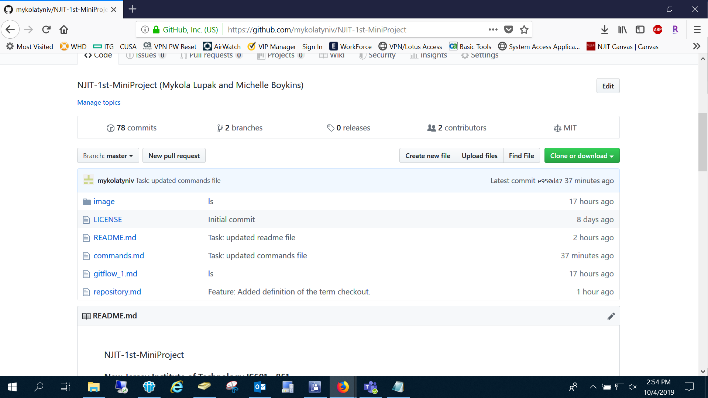

### New Jersey Institute of Technology
### IS601 - 851
### NJIT-1st-MiniProject
### Project Members: Michelle Boykins and Mykola Lupak
#### Objective:
In this project, students were required to work in groups in 2 or 3. A single repository was to be developed between each group. One person was elected to merge  pull requests as the team leader. It is required to have at least 10 substantive commits per group member that are marked "feature". Any fixes to "features" must be marked as fixes and do not count.  Commits for creating files or renaming files or other non-feature work should be named "task".  

Each project* must include an explanation of how the usage of Git, Docker, automated testing, and continuous integration can improve the productivity and competitiveness of a company. It must also include a section that explains commands and gives example(s) usage for Vi to create and edit files on linux and the basic commands that you need to manage the file system. The gitFlow workflow must also be explained and a section to define and give examples of how to use the Git commands and terminology in the list provided (see link to Vi and Basic Commands to Manage a File System below. 

Each required section can be found by clicking on the Index links below.  (*For a project group of two members)

#### Index:
* [Git, Docker, Automated Testing and Continuous Integration: Improve the Productivity and Competitivenes of Companies](/usage_git_docker_auto_cont.md)
* [Vi and Basic Commands to Manage a File System](/commands.md)
* [The gitFlow Workflow](/gitflow_1.md)
* [Git Commands and Terminology](/repository.md)
* [Sources, Tutorials and Additional Readings](/sources.md)
* <a href="#changelog">Changelog</a> 
* <a href="#contributions">Contributions</a> 
 
 
 
 
 
 <a name="contributions">
 
#### Contributions:
- **Basic commands to manage a file system - Mykola Lupak**
- **The usage of Vi to create and edit files on Linux  - Mykola Lupak**
- **Readme File - Mykola Lupak**
- **Sources, Tutorials and Additional Readings - Mykola Lupak & Michelle Boykins**
- **The gitFlow Workflow  - Michelle Boykins**
- **Git Commands - Michelle Boykins**
- **Git, Docker, Automated Testing and Continuous Integration: Improve the Productivity and Competitivenes of Companies- Michelle Boykins**

<a name="changelog">
 
#### Change Log:

- 10/8/2019 Michelle updated content and made edits on Rusage_git_docker_auto_cont.md file
- 10/8/2019 Michelle updated content and made edits on Repository.md file
- 10/7/2019 Mykola Lupak updated commands.md file with additional information and new example images
- 10/7/2019 Mykola Lupak - updated readme file and uploaded new image 1.PNG
- 10/7/2019 Mykola Lupak deleted old readme file
- 10/7/2019 Michelle comitted and added usage_git_docker_auto_cont.md file. 
- 10/7/2019 Michelle comitted and added sources file. 
- 10/6/2019 Michelle updated readme changelog.
- 10/5/2019 Michelle updated readme changelog.
- 10/5/2019 Michelle uploaded images fastforward_merge.png, fork.png, fork_github.png,threeway_merge.png to image folder.
- 10/5/2019 Michelle uploaded images after_pushing2.png, before_pushing2.png, commit.png,fastforward_merge.png to image folder.
- 10/5/2019 Michelle comitted and added definition for term master branch.
- 10/5/2019 Michelle comitted and added definition for term status.
- 10/5/2019 Michelle comitted and added definition for term remote add/remove/show.
- 10/5/2019 Michelle comitted and added definition for term pull.
- 10/5/2019 Michelle comitted and added definition for term push.
- 10/5/2019 Michelle comitted and added definition for term checkout.
- 10/5/2019 Michelle comitted and added definition for term merge.
- 10/4/2019 Mykola Lupak updated image file
- 10/4/2019 Mykola Lupak deleted workflow file
- 10/4/2019 Michelle updated Readme.md.
- 10/4/2019 Michelle comitted and added definition for term commit.
- 10/4/2019 Michelle comitted and added definition for term branch.
- 10/4/2019 Michelle comitted and added definition for term fork.
- 10/3/2019 Michelle comitted and added explanation for gitFlow Workflow.
- 10/3/2019 Michelle uploaded images clone_image.png, gitflow.png, git_repos_image_source.png to image folder.
- 10/3/2019 Michelle comitted and added definitions for gitflow and Git commands and terminology.
- 9/26/2019 Mykola Lupak created new repository
- 9/26/2019 Mykola Lupak created file commands.md
- 9/26/2019 Michelle Boykins and Mykola Lupad updated README.md file
- 9/26/2019 Mykola upak created and uploaded image 
- 9/26/2019 Mykola Lupak added information to readme file
- 9/26/2019 Mykola Lupak created new repository

**Image**
Mini Project Image.

