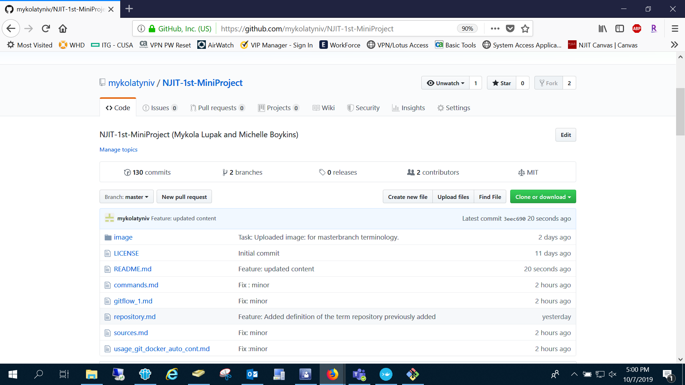

NJIT-1st-MiniProject

**New Jersey Institute of Technology**
**IS601 - 851**

**Names: Michelle Boykins and Mykola Lupak**

**Pages Index**

- **Commands Part - Mykola Lupak**:
- You must have a section that explains commands and gives example(s) usage for use Vi to create and edit files on Linux and the basic commands that you need to manage the file system: Questions to answer: What is it? Why do you do it? How do you do it?

Command | Link
------------ | -------------
**cd** | Page Link
**mkdir** | Page Link
**cp** | Page Link
**pwd** | Page Link
**mv** | Page Link
**rm** | Page Link
**history** | Page Link
**Home directory and ~ command** | Page Link
**file paths in linux** | Page Link
**Using the tab key to complete file paths** | Page Link
**Using up and down arrow for history** | Page Link
**vi** | Page Link

- Workflow Part - Michelle Boykins:

**Changelog**
- Mykola Lupak created new repository
- Michelle Boykins created file workflow.md
- Mykola Lupak created file commands.md
- Michelle Boykins and Mykola Lupad updated README.md file
- Mykola Lupak created source file
- Mykola Lupak created and uploaded image 
- Mykola Lupak added to readme file
- Mykola Lupak updated commands file
- Michelle Boykins uploaded new pages

**Formating and style:**

- [x] Use separate pages as necessary, don't mix the sections up, use one or more pages.

- [x] The Readme file should show your group member's name

- [x] The Readme file should be an index to your other pages and link to them.

- [x] Use markdown (Links to an external site.) to style the pages nicely with headings, bullet points, multiple pages linked together. and pictures.

- [x] Put a "Changelog" on your readme files that you list all of the changes to the document and who did them.

- [x]  Put a section of sources with links to tutorials and feel free to link to other documents in your work.

**Markdown format sample**
- [x] @mentions, #refs, [links](), **formatting**, and <del>tags</del> supported
- [x] list syntax required (any unordered or ordered list supported)
- [x] this is a complete item
- [ ] this is an incomplete item

**Image**
Mini Project Image.

