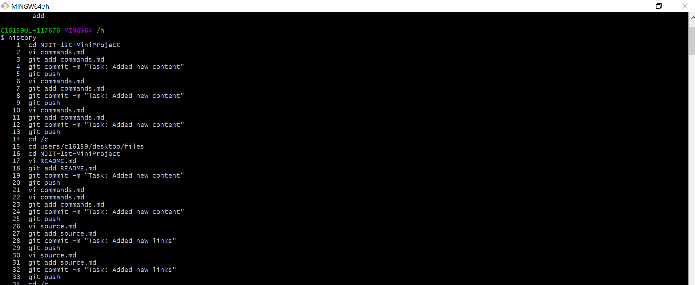
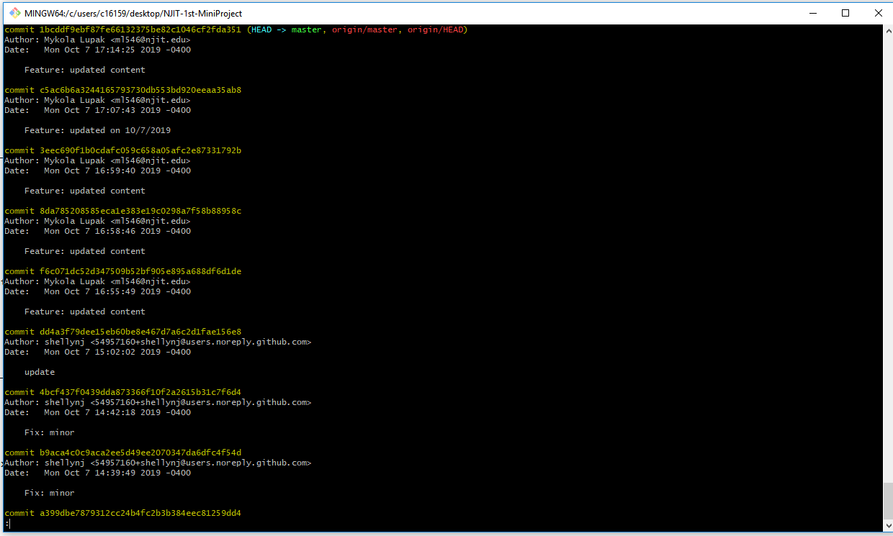
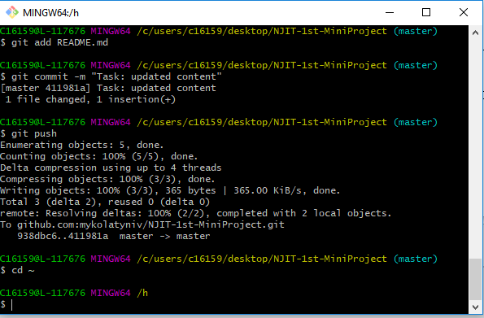

# Git Commands Part <a name="top">

Return to Readme Page [Click Here](/README.md)

*	 <a href="#cd">cd </a> 
*	 <a href="#2">mkdir </a>
*	 <a href="#cp">cp </a> 
*	 <a href="#pwd">pwd</a> 
*	 <a href="#mv">mv</a> 
*	 <a href="#rm">rm</a> 
*	 <a href="#history">History</a>
*	 <a href="#home">Home directory and ~</a>
*	 <a href="#file">File paths in linux</a>
*	 <a href="#path">Using the tab key to complete file paths</a>
*	 <a href="#arrow">Using up and down arrow for history</a>
*	 <a href="#vi">vi</a>
___________________________________________________________________________________________________________________________________
 
<a name="cd">
  
## CD
 - change directory, Navigate to the Home Directory (Default folder for the current user). 

## Example: 
 - cd 
1. Navigate to a specific folder in the file system: 
 - cd /c/SomeFolder/SomeOtherFolder/
2. Navigate to a specific folder in the file system (if there are spaces in the directory path): 
 - cd “/c/Some Folder/Some Other Folder/”
3. Go back to the previous Location: 
 - cd -
4. Move Up One Directory Level: 
 -  cd ..

</a>

<a href="#top">Return to Git Commands</a>
 
 
___________________________________________________________________________________________________________________________________
<a name="2"> 
  
## MKDIR 

 - make new directory" command, create a new folder.

### Example:
 - mkdir new-folder
1. Create a folder in the current directory (with spaces in the folder name): 
 - mkdir “New Folder Name”
2. Create a folder at the specific directory path: 
 - mkdir /c/ExistingParentFolder/NewFolderName
3. Create a folder at the specific directory path, and create parent directories as needed:
 - mkdir -p /c/NewParentFolder/NewFolderName
4. Create a folder at the specific directory path, create parent directories as needed, and print a description of what was done in the console window: 
 - mkdir -p --verbose /c/NewParentFolder/NewFolderName

</a>

<a href="#top">Return to Git Commands</a>
 
 
___________________________________________________________________________________________________________________________________

<a name="cp"> 
  
## CP 

 - cp stands for copy. This command is used to copy files or group of files or directory. It creates an exact image of a file on a disk with different file name. cp command require at least two filenames in its arguments. 

### Example:
 - cp [OPTION] Source Directory
1. One or more arguments : If the command has one or more arguments, specifying file names and following those arguments, an argument specifying directory name then this command copies each source file to the destination directory with the same name, created if not existed but if already existed then it will be overwritten
 - cp Src_file1 Src_file2 Src_file3 Dest_directory

</a>

<a href="#top">Return to Git Commands</a>
 
 
___________________________________________________________________________________________________________________________________

<a name="pwd"> 
  
## PWD 

- print working directory, It will return the path to a local folder on your computer's disk

### Example:
 - pwd
 - /users/mykola, if not ran command cd ~

</a>

<a href="#top">Return toGit Commands</a>
 
 
___________________________________________________________________________________________________________________________________

<a name="mv"> 
  
## MV 

- mv stands for move. change an existing file path and stage. It has two distinct functions:
- (i) It rename a file or folder.
- (ii) It moves group of files to different directory.

### Example:
 - git mv [existing-path] [new-path]
1. The "mv" command can also be used to rename a file:
 - git mv old-filename.ext new-filename.ext

</a>

<a href="#top">Return to Git Commands</a>
 
 
___________________________________________________________________________________________________________________________________

<a name="rm"> 
  
## RM 

 - delete the file from project and stage the removal for commit. Don't use the UNIX command rm file-name. Must perform a "git commit" to update the repository.
 - -I (or --interactive) = Prompt before removal
 - -v (or --verbose) = Explain what is being done

### Example:
- git rm image.md
1. When trying to delete a folder, however, please note that you'll have to add the "-r" flag (which stand for "recursive"):
 - rm -r path/to/folder
2. Prompt for confirmation before remove the specified file from the current directory (no spaces):
 - rm -i DeleteFileName
3. Removes the specified file and reports what was done in the console window: 
 - rm -v DeleteFileName

</a>

<a href="#top">Return to Git Commands</a>
 
 
___________________________________________________________________________________________________________________________________

<a name="history"> 
  
## History 

- checking your git bash previsuly command history. 

### Example:
- history

- git log

</a>

<a href="#top">Return to Git Commands</a>
 
 
___________________________________________________________________________________________________________________________________

<a name="home"> 
  
## Home directory and ~

 - ~ represents your home directory. Changing the HOME environment variable will change where it goes.

### Example:
1. Change user's home directory, which is set by the $HOME environment variable. (HOME=/c/user/custom/home)
  - cd ~ 
- 

</a>

<a href="#top">Return to Git Commands</a>
 
 
___________________________________________________________________________________________________________________________________

<a name="file"> 
  
## File paths in linux

- find the location of GIT installation directory in linux

### Example:
- cd /home/YOURNAME/

</a>

<a href="#top">Return to Git Commands</a>
 
 
___________________________________________________________________________________________________________________________________

<a name="path"> 
  
## Using the tab key to complete file paths

- It autocompletes what you've written, which reduces typos very efficiently. For example, when you want to switch to a different directory, you can either type every component of the path yourself

### Example:
  - cd ~/projects/acmedesign/documentation 
1. Or you make use of the TAB key (try this yourself!)
  - cd ~/pr[TAB]ojects/ac[TAB]medesign/doc[TAB]umentation/

</a>

<a href="#top">Return to Git Commands</a>
 
 
___________________________________________________________________________________________________________________________________

<a name="arrow"> 
  
## Using up and down arrow for history

- ARROW UP key, you can step through the last commands you called (starting with the most recently used). ARROW DOWN will move forward in history towards the most recent call

### Example:
  - Arrow UP
  - ARROW DOWN

</a>

<a href="#top">Return to Git Commands</a>
 
 
___________________________________________________________________________________________________________________________________

<a name="vi"> 
  
## VI

- open text editor

### Example:
- vi commands.md > i > type your text> press esc > type wq. Thank git add commands.md> git commit -m "test" and final step: git push

</a>

<a href="#top">Return to Git Commands</a>
 
 
___________________________________________________________________________________________________________________________________

Readme Page [Click Here](/README.md)

