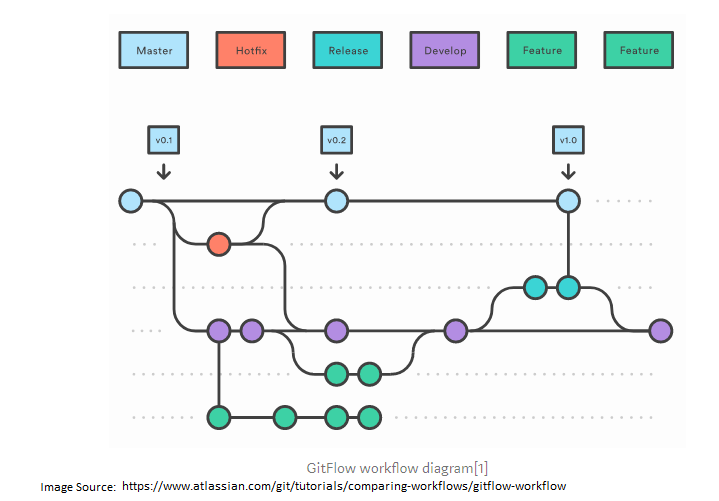

# gitFlow Workflow

[Return to Readme ](/README.md)

GitFlow is a branching model for Git, created by Vincent Driessen. “One of the great things about GitFlow is that it makes parallel development very easy, by isolating new development from finished work. New development (such as features and non-emergency bug fixes) is done in feature branches, and is only merged back into main body of code when the developer(s) is happy that the code is ready for release.”1

In order to switch from one task to another you must first commit your changes and then create a new feature branch for the new task. When your new task is complete checkout the original feature branch you were working on and then continue working where you left off. 

Gitflow is ideally suited for projects that have a scheduled release cycle. This workflow doesn’t add any new concepts or commands beyond what’s required for the Feature Branch Workflow. Instead, it assigns very specific roles to different branches and defines how and when they should interact. In addition to feature branches, it uses individual branches for preparing, maintaining, and recording releases. Of course, you also get to leverage all the benefits of the Feature Branch Workflow: pull requests, isolated experiments, and more efficient collaboration.

The Gitflow Workflow defines a strict branching model designed around the project release. This provides a robust framework for managing larger projects. 

**Each branch defined:**
*	Master: Stable, direct to production.
*	Develop: Unstable, all feature changes will be pushed here.
*	Feature: Check out from Develop branch, and push changes back to it.
*	Hotfix: Check out from Master, push changes to Master and Develop.
*	Release: Semi-stable, ready to release, following with a few bugfixes. Checkout from Develop and push to both Master and Develop.

<b>How does gitFlow work? </b> 
Instead of a single master branch, this workflow uses two branches to record the history of the project. The master branch stores the official release history, and the develop branch serves as an integration branch for features.
v0.1,v0.2 and v1.0, in the image above, represent the version numbers in the master branch which are commits. A develop branch is created and will contain a complete history of the project.  Each new feature of the project resides in its own branch, Feature Branch, which can be pushed to the central repository for backup/collaboration. Instead of branching off of master, feature branches use develop as their parent branch. When a feature is complete, it gets merged back into develop. Features should never interact directly with master. Feature branches are generally created off the latest develop branch. When you’re done with the development work on the feature, the next step is to merge the feature branch into develop. Once develop has acquired enough features for a release (or a predetermined release date is approaching), you fork a release branch off of develop. Creating this branch starts the next release cycle, so no new features can be added after this point—only bug fixes, documentation generation, and other release-oriented tasks should go in this branch. 

Once development is complete, the release branch gets merged into master and tagged with a version number. In addition, it should be merged back into develop, which may have progressed since the release was initiated

Maintenance or “hotfix” branches are used to quickly patch production releases. Hotfix branches are a lot like release branches and feature branches except they're based on master instead of develop. This is the only branch that should fork directly off of master. As soon as the fix is complete, it should be merged into both master and develop (or the current release branch), and master should be tagged with an updated version number.

____________________________________________________________
1https://datasift.github.io/gitflow/IntroducingGitFlow.html

Sources:  
Introducing GitFlow: https://datasift.github.io/gitflow/IntroducingGitFlow.html  
Gitflow Workflow: https://www.atlassian.com/git/tutorials/comparing-workflows/gitflow-workflow

Readme Page [Click Here](/README.md)
