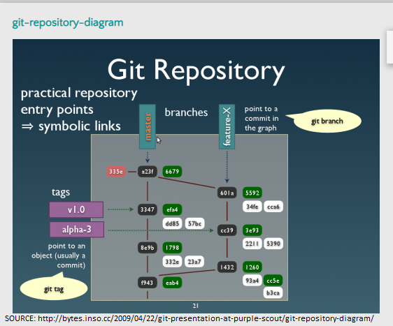
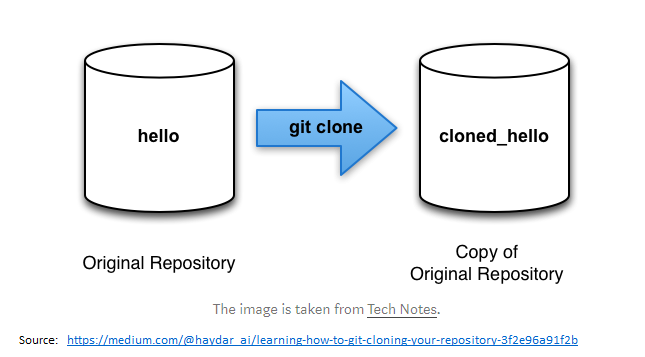
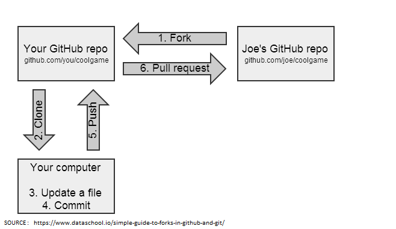

# Git Commands and Terminology <a name="top">

*	<a href="#repository">Repository </a>
* <a href="#clone">Clone</a> 
*	<a href="#fork">Fork </a> 
*	 <a href="#clone">Branch</a> 
*	 <a href="#clone">Commit</a> 
*	 <a href="#clone">Merge</a> 
*	 <a href="#clone">Checkout</a> 
*	 <a href="#clone">Push</a> 
*	<a href="#clone">Pull </a> 
*	 <a href="#clone">Remote Add / Remove / Show </a> 
*	 <a href="#clone">Status</a> 
*	<a href="#clone">Master Branch </a> 

___________________________________________________________________________________________________________________________________
 
<a name="repository">
  
## Repository  
  
A repository generically refers to a central place where data is stored and maintained. A repository can be a place where multiple databases or files are located for distribution over a network, or a repository can be a location that is directly accessible to the user without having to travel across a network. 

Git is a program that tracks changes made to files. Once installed, Git can be initialized on a project to create a Git
repository. A Git repository is the .git/ folder inside a project. This repository tracks all changes made to files in your
project, building a history over time.

To start a new git repository using the command line:
1.	Create a directory to contain the project.
2.	Go into the new directory.
3.	Type git init .  -->To initialize the directory and creates a new Git repository
4.	Write some code.
5.	Type git add to add the files.
6.	Type git commit .

</a>

<a href="#top">Return to  Git Commands and Terminology</a>
 
 
___________________________________________________________________________________________________________________________________
<a name="clone"> 
  
## Clone  

The git clone command copies an existing Git repository. This is sort of like SVN checkout, except the “working copy” is a full-fledged Git repository—it has its own history, manages its own files, and is a completely isolated environment from the original repository. 
The "clone" command downloads an existing Git repository [remote] to your local computer.
You will then have a full-blown, local version of that Git repo and can start working on the project.
Typically, the "original" repository is located on a remote server, often from a service like GitHub, Bitbucket, or GitLab). That remote repository's URL is then later referred to as the "origin".

#### Example:
  
Thie following commands will download the project to a folder named after the Git repository ("Mini_Project_1" in this case)

### Repository Owner USERNAME: Web_Dev_IS601    
### GITHUB REPOSITORY PROJECT: Mini_Project_1  
### cd folder/to/clone-into/        ---> Change to the folder on your local directory that will contain the cloned repository  
Clone Command**:  
### <b>git clone </b>[https://github.com/Web_Dev_IS601/Mini_Project_1.git]    
**SSH/HTTPS URL FORMAT :   git@name-of-git-host:username/project-name (SSH version) or [https://name-of-git-host/username/project-name] (HTTPS version).

</a>
<a href="#top">Return to  Git Commands and Terminology</a>

 
 

___________________________________________________________________________________________________________________________________

<a name="fork">
  
  
# Fork
A fork is a copy of a repository. Forking a repository allows you to freely experiment with changes without affecting the original project. Most commonly, forks are used to either propose changes to someone else's project or to use someone else's project as a starting point for your own idea.

Most commonly, forks are used to either propose changes to someone else's project or to use someone else's project as a starting point for your own idea.

Propose changes to someone else's project
A great example of using forks to propose changes is for bug fixes. Rather than logging an issue for a bug you've found, you can: 
*	Fork the repository.
*	Make the fix.
*	Submit a pull request to the project owner.

#### Example: 
Forking a repository is a two-step process.
1. On GitHub, navigate to the octocat/Spoon-Knife repository.
2. In the top-right corner of the page, click Fork {See image}.

A fork must be later synced with the upstream.
During git clone you actually copy the original repo. While a fork is just a request to clone the project and register under your username. Github also keeps track of relationship between the two repos. ... A "fork" is the typical nickname for a server-side clone (e.g. push to your fork before opening a pull request). 

## Difference between cloning and forking:
### (a) Cloning
By cloning a project, you are downloading a copy of that project to your local computer.
If you intend to collaborate on this project, you will only be able to publish / upload your changes if you have permission to do so (provided by the project's owner).  

### (b) Forking
By forking a project, you are creating your own copy of that project.
Since you are the owner of that project, you will be able to make any changes you like and add them (push them) back into the remote repository (the "fork"). You can only fork projects that are either public or where you have sufficient permissions.

<a href="#top">Return to  Git Commands and Terminology</a>
 
 
___________________________________________________________________________________________________________________________________
