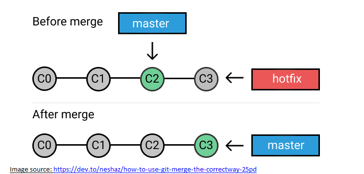

# Git Commands and Terminology <a name="top">

Readme Page [Click Here](/README.md)

*	<a href="#repository">Repository </a>
* <a href="#clone">Clone</a> 
*	<a href="#fork">Fork </a> 
*	 <a href="#branch">Branch</a> 
*	 <a href="#commit">Commit</a> 
*	 <a href="#merge">Merge</a> 
*	 <a href="#checkout">Checkout</a> 
*	 <a href="#push">Push</a> 
*	<a href="#clone">Pull </a> 
*	 <a href="#clone">Remote Add / Remove / Show </a> 
*	 <a href="#clone">Status</a> 
*	<a href="#clone">Master Branch </a> 

___________________________________________________________________________________________________________________________________
 
<a name="repository">
  
## Repository  
  
A repository generically refers to a central place where data is stored and maintained. A repository can be a place where multiple databases or files are located for distribution over a network, or a repository can be a location that is directly accessible to the user without having to travel across a network. 

Git is a program that tracks changes made to files. Once installed, Git can be initialized on a project to create a Git
repository. A Git repository is the .git/ folder inside a project. This repository tracks all changes made to files in your
project, building a history over time.

To start a new git repository using the command line:
1.	Create a directory to contain the project.
2.	Go into the new directory.
3.	Type git init .  -->To initialize the directory and creates a new Git repository
4.	Write some code.
5.	Type git add to add the files.
6.	Type git commit .

</a>

<a href="#top">Return to  Git Commands and Terminology</a>
 
 
___________________________________________________________________________________________________________________________________
<a name="clone"> 
  
## Clone  

The git clone command copies an existing Git repository. This is sort of like SVN checkout, except the “working copy” is a full-fledged Git repository—it has its own history, manages its own files, and is a completely isolated environment from the original repository. 
The "clone" command downloads an existing Git repository [remote] to your local computer.
You will then have a full-blown, local version of that Git repo and can start working on the project.
Typically, the "original" repository is located on a remote server, often from a service like GitHub, Bitbucket, or GitLab). That remote repository's URL is then later referred to as the "origin".

#### Example:
  
Thie following commands will download the project to a folder named after the Git repository ("Mini_Project_1" in this case)

### Repository Owner USERNAME: Web_Dev_IS601    
### GITHUB REPOSITORY PROJECT: Mini_Project_1  
### cd folder/to/clone-into/        ---> Change to the folder on your local directory that will contain the cloned repository  
Clone Command**:  
### <b>git clone </b>[https://github.com/Web_Dev_IS601/Mini_Project_1.git]    
**SSH/HTTPS URL FORMAT :   git@name-of-git-host:username/project-name (SSH version) or [https://name-of-git-host/username/project-name] (HTTPS version).

</a>
<a href="#top">Return to  Git Commands and Terminology</a>

 
 

___________________________________________________________________________________________________________________________________

<a name="fork">
  
  
# Fork
A fork is a copy of a repository. Forking a repository allows you to freely experiment with changes without affecting the original project. Most commonly, forks are used to either propose changes to someone else's project or to use someone else's project as a starting point for your own idea.

Most commonly, forks are used to either propose changes to someone else's project or to use someone else's project as a starting point for your own idea.

Propose changes to someone else's project
A great example of using forks to propose changes is for bug fixes. Rather than logging an issue for a bug you've found, you can: 
*	Fork the repository.
*	Make the fix.
*	Submit a pull request to the project owner.

#### Example: 
Forking a repository is a two-step process.
1. On GitHub, navigate to the octocat/Spoon-Knife repository.
2. In the top-right corner of the page, click Fork {See image}.

A fork must be later synced with the upstream.
During git clone you actually copy the original repo. While a fork is just a request to clone the project and register under your username. Github also keeps track of relationship between the two repos. ... A "fork" is the typical nickname for a server-side clone (e.g. push to your fork before opening a pull request). 

## Difference between cloning and forking:
### (a) Cloning
By cloning a project, you are downloading a copy of that project to your local computer.
If you intend to collaborate on this project, you will only be able to publish / upload your changes if you have permission to do so (provided by the project's owner).  

### (b) Forking
By forking a project, you are creating your own copy of that project.
Since you are the owner of that project, you will be able to make any changes you like and add them (push them) back into the remote repository (the "fork"). You can only fork projects that are either public or where you have sufficient permissions.

<a href="#top">Return to  Git Commands and Terminology</a>
 
 
___________________________________________________________________________________________________________________________________
<a name="branch">  
  
# Branch

A branch in Git is simply a lightweight movable pointer to one of these commits. The default branch name in Git is master. As you initially make commits, you're given a master branch that points to the last commit you made. Every time you commit, it moves forward automatically.  
Branching is the practice of creating copies of programs or objects in development to work in parallel versions, retaining the original and working on the branch or making different changes to each. Each copy is considered a branch; the original program from which the branch is taken is referred to as the trunk, the baseline, the mainline or the master.
Branching is used in version control and software management to maintain stability while isolated changes are made to code. Branching facilitates the development of bug fixes, the addition of new capabilities and the integration of new versions after they have been tested in isolation. 
 
 In the image below, Branch1 and Branch2 are copies of the program in development which will allow the developers to work in parallel versions.
 
 
 
 
#### Example:
##### Scenario:  You are working on a project for Website development.You decide you are going to work on a new issue, namely issue10, pertaining to the website.  You create a branch so that you can do work on issue10. There are a few commits already on the master branch.  To create a new branch and switch to it, follow the following commands:  
$git branch issue10       -> This command creates new branch named “issue10”   
$git check out issue10     -> This command switches to the new branch “issue10”  
Abbreviated command: $git checkout -b issue10
 
 
<a href="#top">Return to  Git Commands and Terminology</a>
 
 
___________________________________________________________________________________________________________________________________
<a name="commit">  
  
# Commit

The "commit" command is used to save your changes to the local repository. You have to explicitly tell Git which changes you want to include in a commit before running the "git commit" command. This means that a file won't be automatically included in the next commit just because it was changed. Instead, you need to use the "git add" command to mark the desired changes for inclusion.  
A commit is not automatically transferred to the remote server, you need to use the "git add" command to mark the desired changes for inclusion. Following the "git add" command the changes will be placed in a staging area awaiting a "git commit" command {see diagram below}.   

 Using the "git commit" command only saves a new commit object in the local Git repository.   
Typing $git commit -m "<message>" at the command line is the proper syntax of the git commit command**.  

#### Example:
Assume you edited a file called hello-world.py and you are ready to commit it to the project’s history. First stage the file with git add: 
$git add hello-world.py 
Then commit the file:   
$git commit -m  “commit message”  
**  -m = Passing the -m option will forgo the text editor and prompt in-favor of an inline message.  
File hello-world.py will be saved in the local Git repository.

<a href="#top">Return to  Git Commands and Terminology</a>
 
 
___________________________________________________________________________________________________________________________________
<a name="merge">  
  
# Merge

The git merge command lets you take the independent lines of development created by git branch and integrate them into a single branch.
Git merge will combine multiple sequences of commits into one unified history. In the most frequent use cases, git merge is used to combine two branches.  There are two main ways Git will merge: Fast Forward and Three way. 

Fast Forward Merge 
A fast-forward merge can occur when there is a linear path between branches that you want to merge (see image below).  

 

Three-Way Merge 
When there is not a linear path to the target branch, Git has no choice but to combine them via a three-way merge. This merge uses an extra commit to tie together the two branches (see image below). 

 

Merge command line syntax:  
$git merge "branch name"     ------>where "branch name" is the name of the branch that will be merged into the receiving branch.  

#### Example:
The code below creates a new branch, adds two commits to it, then integrates it into the main line with a fast-forward merge.  
#Start a new feature named issue10 		------>comment  
$git checkout -b issue10 master  
#Edit some files      				 ------>comment  
git add <file>  
git commit -m "The start of a feature"  
#Edit some files     				 ------>comment  
git add <file>  
git commit -m "The end of a feature"  
#Merge in the issue10 branch   ------>comment  
git checkout master  
git merge issue10				------>Merge a branch  
git branch -d issue10			   ---->Delete a branch  

<a href="#top">Return to  Git Commands and Terminology</a>
 
 
__________________________________________________________________________________________________________________________________
<a name="checkout">  
  
# Checkout

In Git terms, a "checkout" is the act of switching between different versions of a target entity.  The git checkout command operates upon three distinct entities: files, commits, and branches.  

To checkout a specific commit, run the command: git checkout specific-commit-id   

To checkout an existing branch, run the command: git checkout BRANCH-NAME   

You can use the git checkout command to undo changes you’ve made to a file in your working directory. This will revert the file back to the version in HEAD: git checkout -- FILE-NAME

<a href="#top">Return to  Git Commands and Terminology</a>
 
 

__________________________________________________________________________________________________________________________________

<a name="push">  
  
# Push

The git push command allows you to send (or push) the commits from your local branch in your local Git repository to the remote repository.
To be able to push to your remote repository, you must ensure that all your changes to the local repository are committed.

Push command's syntax is as follows: git push {repo name} {branch name}
  
#### Example: Push to a Specific Remote Repository and Branch

Note: In order to push code, you must first clone a repository to your local machine.

Type commands:
#Once a repo is cloned, you'll be working inside of the default branch (the default is `master`)
 git clone https://github.com/<git-user>/<repo-name> && cd <repo-name>
#make changes and stage your files (repeat the `git add` command for each file, or use `git add .` to stage all)
git add <filename>
#now commit your code
git commit -m "added some changes to my repo!"
#push changes in `master` branch to github
git push origin master

__________________________________________________________________________________________________________________________________

Readme Page [Click Here](/README.md)

